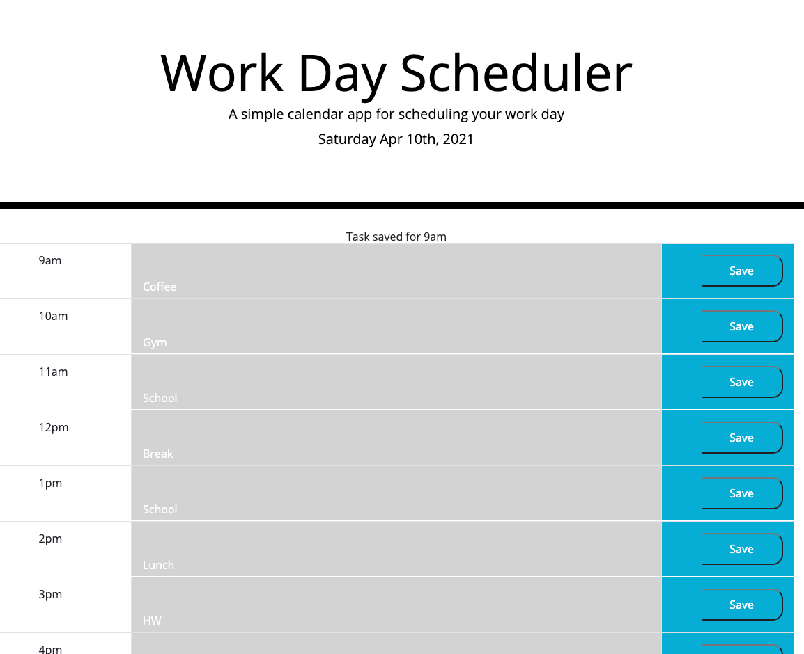

## HW5 Work Day Scheduler

Link: https://angelfloreschicago.github.io/hw5_WorkDayScheduler/

## Page Guide/Description
- The purpose of this website is to help the user schedule his day.
- The user can type in a task per hour between 9am and 5pm.
- As the day goes by the scheduler will change colors depending on what
  time of the day it is.
- The task typed by the user will get saved to local storage and will be
  displayed for the user even when the page is refreshed. 

Notes
- The website still needs some bugs worked out. It mostly has to do with fixing
  the colors depending on the time of day. This would probably be fixed with an
  if statement and working with moment.js. Advice is always appreciated! Thanks!